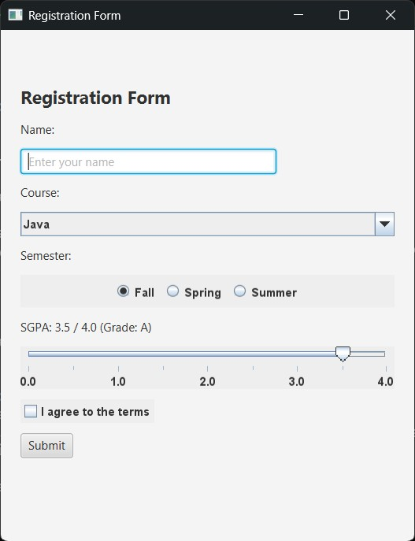

# Registration Form — JavaFX + Swing Demo


A simple desktop registration form built for **CSC 360** that demonstrates JavaFX and Swing components working together in a single window using `SwingNode`.

---

## Overview

This project creates one JavaFX window containing both **JavaFX** and **Swing** UI components. Swing components are embedded inside the JavaFX scene using `SwingNode`, and proper threading is used throughout:

- **Swing components** are created on the Event Dispatch Thread (`SwingUtilities.invokeLater`)
- **JavaFX controls** are updated on the JavaFX Application Thread (`Platform.runLater`)

## Preview



### Key Features
- **Real-Time Input Filtering**: The student name field automatically blocks numbers and special characters as the user types using a JavaFX `TextFormatter`.
- **Form Validation**: Comprehensive checks ensure all fields are properly completed and mandatory terms are accepted before submission.
- **SGPA & 4.0 Grading**: A Swing `JSlider` allows selecting an SGPA from `0.0` to `4.0` (in `0.1` increments), with real-time conversion to letter grades (`A`, `B+`, `B`, `B-`, `C+`, `C`, `D`, `F`) dynamically displayed on a JavaFX label.
- **Dynamic Visual Feedback**: Instant visual confirmation with contextual color coding for error states (crimson) and success summaries (forest green).

---

## Input Validation & Feedback Rules

The application implements a two-tier validation mechanism to safeguard input integrity:

### 1. Real-Time Input Filtering (JavaFX `TextFormatter`)
The `TextField` for the student's name is attached to a filter that only permits alphabetic characters and whitespace:
```java
nameField.setTextFormatter(new TextFormatter<>(change -> {
    if (change.getControlNewText().matches("[a-zA-Z\\s]*")) {
        return change;
    }
    return null; // Rejects keystroke immediately
}));
```
Any attempts to enter numeric digits, punctuation, or special symbols are discarded before reaching the input buffer.

### 2. Submit-Time Validation Checklist
Upon clicking the **Submit** button, the following validations execute sequentially:

| Check | Target Component | Validation Logic | Error Message |
|-------|------------------|------------------|---------------|
| **Name Presence** | `nameField` (JavaFX) | `name.isEmpty()` | `"Please enter your name."` |
| **Digit Guard** | `nameField` (JavaFX) | `name.chars().anyMatch(Character::isDigit)` | `"Name must not contain numbers."` |
| **Character Set** | `nameField` (JavaFX) | `!name.matches("[a-zA-Z\\s]+")` | `"Name can only contain letters and spaces."` |
| **Course Selection** | `courseBox` (Swing) | `course == null || course.isEmpty()` | `"Please select a course."` |
| **Terms Agreement** | `agreeBox` (Swing) | `!agreed` | `"You must agree to the terms before submitting."` |

### 3. Visual Feedback States
- **Validation Failure**: The result label displays in red (`#d32f2f`) with a `❌` indicator and the specific failure reason.
- **Validation Success**: The result label displays in green (`#2e7d32`) with a `✔ Registered successfully!` banner and a consolidated summary of all entered details (Name, Course, Semester, SGPA, and Letter Grade).

---

## UI Components

| Component              | Toolkit    | Purpose                                              |
|------------------------|------------|------------------------------------------------------|
| `Label`                | JavaFX     | Title — "Registration Form"                          |
| `TextField`            | JavaFX     | Text input for the student's name (required)         |
| `JComboBox`            | Swing      | Dropdown to pick a course (Java, Python, C++)        |
| `JRadioButton` (×3)    | Swing      | Radio buttons to select a semester (Fall/Spring/Summer)|
| `JSlider`              | Swing      | SGPA slider (`0.0` – `4.0`) with grade evaluation    |
| `JCheckBox`            | Swing      | Checkbox — "I agree to the terms" (required)         |
| `Button`               | JavaFX     | Submit button (validates and displays output)        |
| `Label`                | JavaFX     | Result label (shows error or success summary)        |

---

## Project Structure

```
CSC360-GROUP9/
├── pom.xml                                        # Maven build config
├── README.md                                      # Documentation
└── src/
    └── main/
        └── java/
            └── com/
                └── csc360/
                    └── RegistrationForm.java      # Single-file application
```

Everything lives in one file — no CSS, no FXML, no extra windows.

---

## Prerequisites

- **Java JDK 17+** (tested up to Java 26)
- **Apache Maven 3.8+**

---

## Build & Execution Lifecycle

### 1. Compile the Project
To compile source code without starting the graphical interface:
```bash
mvn clean compile
```

### 2. Launch the Application

#### Option A: Maven CLI (Recommended)
Launch directly using the JavaFX Maven Plugin:
```bash
mvn javafx:run
```

#### Option B: IDE "Run / Debug"
You can directly click **Run** or **Debug** on `RegistrationForm.java` in any major IDE (IntelliJ IDEA, Eclipse, VS Code, Antigravity IDE, NetBeans). The `main` method uses standard launcher delegation `Application.launch(App.class, args)` and the project is configured with `exec-maven-plugin`.

### 3. Package to JAR
To package the project into a distributable JAR file:
```bash
mvn clean package
```
This produces `registration-form-1.0-SNAPSHOT.jar` inside the `target/` directory.

---

## JVM Modularity & `--add-exports` Flag

Under modern Java versions (JDK 17 through 26+), the **Java Platform Module System (JPMS)** enforces strict encapsulation on internal and cross-toolkit packages.

Because this application bridges Swing and JavaFX via `javafx.embed.swing.SwingNode`, the JavaFX runtime requires explicit module access permissions to the unnamed module. This is configured in `pom.xml` via the `javafx-maven-plugin`:

```xml
<configuration>
    <mainClass>com.csc360.RegistrationForm</mainClass>
    <options>
        <option>--add-exports=javafx.swing/javafx.embed.swing=ALL-UNNAMED</option>
    </options>
</configuration>
```

> [!NOTE]
> If launching the JAR directly outside Maven via standard `java`, pass the export option to prevent encapsulation errors:
> ```bash
> java --add-exports=javafx.swing/javafx.embed.swing=ALL-UNNAMED -jar target/registration-form-1.0-SNAPSHOT.jar
> ```

---

## Troubleshooting & FAQs

### 1. `java.lang.IllegalAccessError: superclass access check failed`
- **Root Cause**: The JVM module system blocked access to `javafx.embed.swing`.
- **Resolution**: Launch via `mvn javafx:run` which passes the `--add-exports` flag automatically, or add `--add-exports=javafx.swing/javafx.embed.swing=ALL-UNNAMED` to your IDE's VM options.

### 2. `UnsupportedClassVersionError: ... has been compiled by a more recent version of the Java Runtime`
- **Root Cause**: The active Java runtime is older than JDK 17.
- **Resolution**: Check your installed Java version with `java -version` and set your `JAVA_HOME` environment variable to point to JDK 17 or higher.

### 3. `GraphicsEnvironment.isHeadless() returns true` / `HeadlessException`
- **Root Cause**: Attempting to launch the desktop application in a headless CI/CD container or remote shell without an active window display server.
- **Resolution**: Run within a desktop environment, or configure a virtual frame buffer such as `xvfb-run mvn javafx:run` on Linux systems.

### 4. Swing and JavaFX DPI Scaling Differences on Windows
- **Root Cause**: On high-DPI displays (125% or 150% scaling), Swing and JavaFX calculate subpixel anti-aliasing independently.
- **Resolution**: The layout utilizes responsive insets and centered alignment (`Pos.CENTER_LEFT`) to prevent visual clipping. If needed, pass `-Dsun.java2d.uiScale=1.0` as a JVM argument.

---

## Grading Scale (Out of 4.0)

| SGPA Range  | Letter Grade |
|-------------|--------------|
| 3.7 – 4.0   | **A**        |
| 3.3 – 3.6   | **B+**       |
| 3.0 – 3.2   | **B**        |
| 2.7 – 2.9   | **B-**       |
| 2.3 – 2.6   | **C+**       |
| 2.0 – 2.2   | **C**        |
| 1.0 – 1.9   | **D**        |
| 0.0 – 0.9   | **F**        |

---

## Threading Model

```
┌─────────────────────────────────┐
│   JavaFX Application Thread     │
│                                 │
│  • TextField, Button, Labels    │
│  • Button click handler starts  │──── reads name ────┐
│                                 │                    │
└─────────────────────────────────┘                    │
                                                       ▼
┌─────────────────────────────────┐     SwingUtilities.invokeLater()
│   Swing EDT (Event Dispatch     │
│          Thread)                │
│                                 │
│  • JComboBox, JCheckBox         │
│  • JRadioButtons, JSlider       │──── reads course, semester,
│                                 │     SGPA, agreement
└─────────────────────────────────┘          │
                                             ▼
                                   Platform.runLater()
                                             │
                                             ▼
                                   JavaFX result label updated
                                   (validates inputs & shows status)
```

---

## Component Interaction Walkthrough

Here is the exact lifecycle of user actions and cross-toolkit event dispatches:

1. **Initialization**:
   - The JavaFX stage is configured with a 420×520 scene.
   - For each Swing component (`courseBox`, `fallRadio`, `springRadio`, `summerRadio`, `sgpaSlider`, `agreeBox`), a `SwingNode` is created on the JavaFX Application Thread, while component initialization and `.setContent(...)` are dispatched onto the Swing Event Dispatch Thread (EDT).
   - Default selections: Course dropdown defaults to `Java`, Semester defaults to `Fall`, SGPA slider defaults to `3.5` with label `"SGPA: 3.5 / 4.0 (Grade: A)"`.

2. **Real-Time Slider Dragging**:
   ```text
   User drags JSlider (Swing)
     └─► ChangeListener fires on Swing EDT
           └─► Computes SGPA = value / 10.0 and letter grade via getGrade()
                 └─► Dispatches Platform.runLater(...) to JavaFX Thread
                       └─► Updates JavaFX sgpaLabel with formatted text
   ```

3. **Form Submission & Cross-Thread Validation**:
   ```text
   User clicks "Submit" (JavaFX Button)
     └─► onAction handler triggers on JavaFX Application Thread
           └─► Extracts nameField.getText()
                 └─► Dispatches SwingUtilities.invokeLater(...) to Swing EDT
                       ├─► Extracts JComboBox, JRadioButton, JSlider, JCheckBox state
                       ├─► Performs sequential validation checks
                       └─► Dispatches Platform.runLater(...) to JavaFX Thread
                             └─► Applies CSS styling (#d32f2f for error / #2e7d32 for success)
                             └─► Updates resultLabel text with error or registration summary
   ```

---

## Developer Guide: Extending the Form

To integrate additional UI controls while maintaining strict thread safety and toolkit interoperability:

### Adding a New Swing Component
1. Create a `SwingNode` wrapper on the JavaFX thread:
   ```java
   SwingNode customNode = new SwingNode();
   ```
2. Instantiate and attach your Swing component on the EDT:
   ```java
   SwingUtilities.invokeLater(() -> {
       JSpinner customSpinner = new JSpinner(new SpinnerNumberModel(1, 1, 10, 1));
       customNode.setContent(customSpinner);
   });
   ```
3. Add `customNode` to the root `VBox` layout.
4. Read its state inside the Submit handler's `SwingUtilities.invokeLater()` block.

### Adding a New JavaFX Control
1. Instantiate the control directly on the JavaFX thread (e.g., `DatePicker datePicker = new DatePicker();`).
2. Add the control directly to the `VBox` layout.
3. Read its value directly in the button's `setOnAction` handler prior to delegating to Swing.

---

## Authors

**CSC 360 — Group 9**

